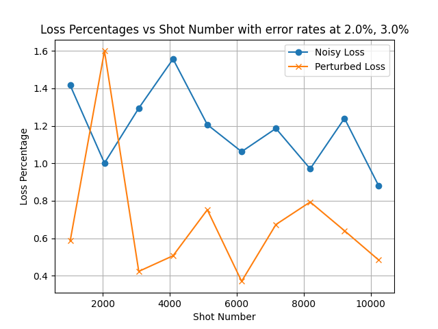
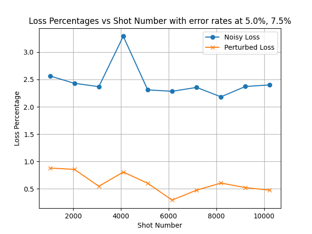
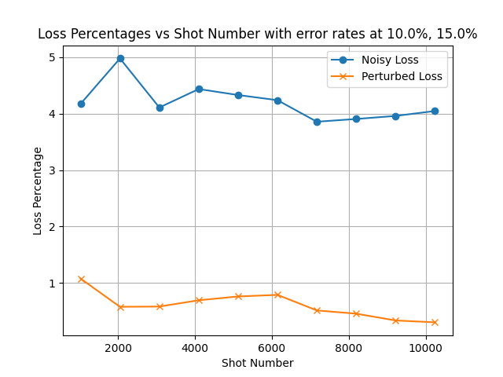

# Quantum Internet noise handling as Perturbations

In this Project we attempt to simulate noise in an intermediate-to-large scale Quantum Internet application and handle it using $n^{th}$ order Quantum Hamiltionian time-dependent perturbations.

>This project remains a work in progress. While the results are promising they are experimental and are to be treated as such.

## Unperturbed Hamiltonian:

```math
\begin{equation*}
H_{0} = -i
\begin{pmatrix}
0 & 1  \\
1 & 0 
\end{pmatrix}
\end{equation*}
```
Hermitian operator that governs the unperturbed dynamics. Physically, this could correspond to the interaction-free evolution of a two-level quantum system (like a qubit).

The evolution under $H_{0}$​ alone would follow:

```math
\frac{d}{dt}\psi {t} = H_{0} \psi {t}
```

## Perturbation Example:

We used two time-dependent perturbation Hamiltonians were defined as:

```math
\begin{equation*}
V_{1}(t) = -i
\begin{pmatrix}
0 & 1  \\
-1 & 0 
\end{pmatrix}
\end{equation*}
```
```math
\begin{equation*}
V_{2}(t) = -i
\begin{pmatrix}
0 & i  \\
-i & 0 
\end{pmatrix}
\end{equation*}
```

## Circuit Example


The rotation angles $(0.4)$ are placeholders for tunable parameters. In a variational algorithm, these would be optimized to minimize or maximize a cost function.

```python
# Parameters
t = 1.0  # Evolution time
n_trotter = 5  # Number of Trotter steps

# Trotterization
for _ in range(n_trotter):
    unperturbed_evolution(qc, t / n_trotter)
    perturbation_1(qc, t / n_trotter)
    perturbation_2(qc, t / n_trotter)
```


## Experiment Data

We have simulated the circuit across a range of measurement shots and across a few error rates, with the ideally simulated circuits as a basis of comparison.

For these measurements we use the simple, 2-qubit circuit shown above and we apply a depolarizing error in 2 layers where $error_2=1.5\cdot error_1$

### 2% Depolarizing error:

After applying this (low) noise to the circuit, we take the following measurements:



Further, we measured the following averages:

- Average Noisy Loss: 1.18%
- Average Perturbed Loss: 0.68%

Nearly __halving__ the measurement error (also expressed as loss).

### 5% Depolarizing error:

After applying this noise to the circuit, we take the following measurements:



Further, we measured the following averages:

- Average Noisy Loss: 2.45%
- Average Perturbed Loss: 0.61%

Reducing the average loss by a __factor of 4__.

### 10% Depolarizing error:

After applying this (moderate) noise to the circuit, we take the following measurements:



Further, we measured the following averages:

- Average Noisy Loss: 4.20%
- Average Perturbed Loss: 0.60%

Reducing the average loss by a __factor of 7__.

At least for this circuit, we can already see a trend emerging where the bigger the error is, the better the perturbed circuit is performing compared to the non-perturbed one.